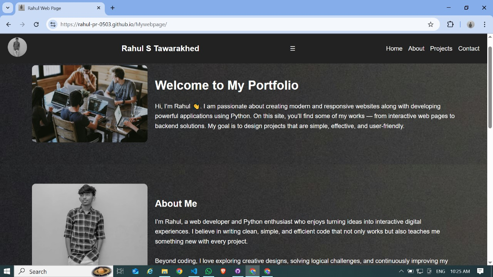

# 🌐 Rahul's Portfolio Website

A modern, responsive **personal portfolio website** built with **HTML**, **CSS**, and **JavaScript**.  
It highlights my journey, projects, and ways to connect with me.

---

## ✨ Features

- 🏠 **Home Section** – A warm welcome with personal introduction
- 👨‍💻 **About Section** – My story, skills, and passions
- 💡 **Projects Section** – Showcasing my first web app:  
  🎮 Rock–Paper–Scissors Game ([Play Here](https://rahul-pr-0503.github.io/Rock-Paper-Scissor/))
- 📞 **Contact Section** – Direct links to Email, LinkedIn, Instagram, and Facebook
- 🎨 **Custom Styling (CSS)**
  - Sticky navigation bar
  - Responsive layout for all devices
  - Buttons with hover effects
  - Section backgrounds with overlay images
- ⚡ **JavaScript Enhancements**
  - Navbar style change on scroll
  - Mobile-friendly hamburger menu
  - Disable right-click on images (to prevent copying)
  - Smooth reveal animations when scrolling

## 📂 Project Structure

portfolio/
│── index.html # Main HTML file
│── style.css # Website styling
│── script.js # JavaScript interactivity
│── images/ # All images (Rahul.jpg, home.jpg, project.jpg, section.jpg)
│── README.md # Documentation

---

## 🖼️ Preview



---

## 🚀 Getting Started

### 1. Clone this repository

```bash
git clone https://github.com/Rahul-pr-0503/Mywebpage.git
```
